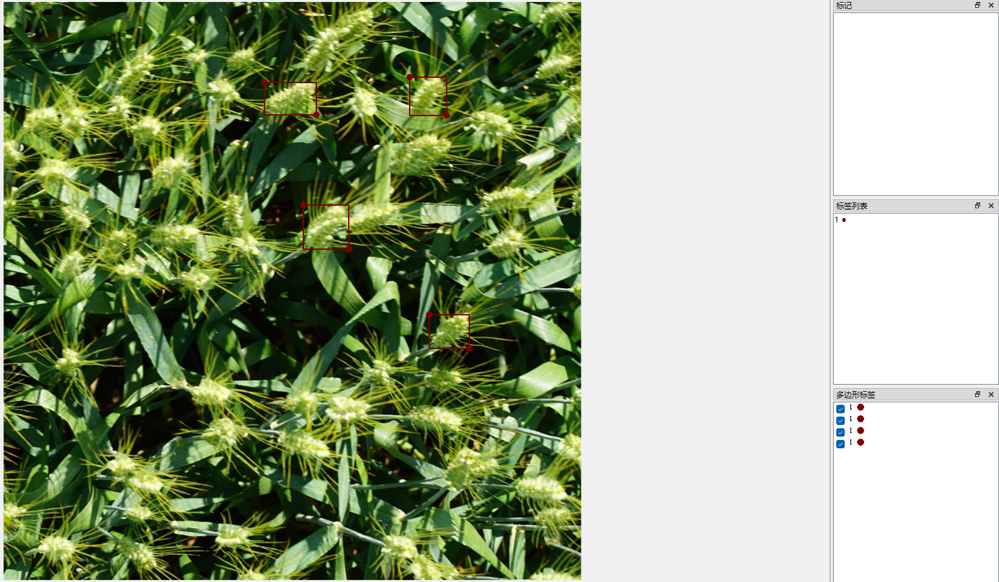
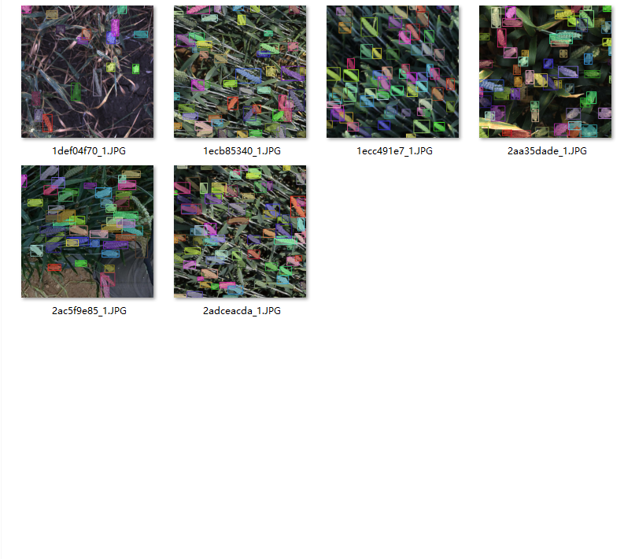

# SAM3批量推理

该仓库能让你只用少量提示框就能实现批量推理整个数据集，特别适用于模型私有数据集的辅助标注

对于一些常见的目标，如人、猫和狗之类的，只需给相应的language prompt就能完成批量推理，而对于私有数据集或着说sam3模型没有训练到的数据集，则无法用language prompt进行批量推理，只能一张图给一个提示框推理一次，这很麻烦，本仓库解决了这个问题

现在你只需要准备好几张图，并**在这几张图上绘制几个提示框**，就能完成**整个数据集**的推理

## 使用流程

**1、部署好SAM3的运行环境**

**2、用labelme等软件标注提示框**

准备好1-5张图将它放至./datasets/init目录下。每张图用矩形框标注1-5个矩形框，将标签设置为1，将标签文件保存在该目录下

****3、将待检测的文件放在./datasets/images目录下**

**4、运行vision_prompt_batch_infer.py文件***

在./datasets/outputs目录下查看推理结果*

